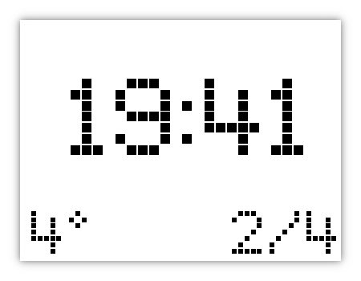

# e-Ink Clock

This is the source code used for building a DIY clock using [Inky's wHAT e-Ink display](https://shop.pimoroni.com/products/inky-what).

## Test

```
poetry install
poetry shell
python clock.py debug
```

It shows the rendered image like this:



## Setup

I used [Raspberry Pi Zero W](https://www.raspberrypi.com/products/raspberry-pi-zero-w/) so I had to solder the header pins and then connect it to the display. There are a few tutorial for it, it's easy. I also installed a minimal Pi OS on my Raspberry Pi and connected to it using SSH but there are other ways to work with your Pi.

To load weather information you need to:

1. [Sign up](https://home.openweathermap.org/users/sign_up) with open weather API to get your `wather-api-key`. It's free.
2. Use Google map to [get your location latitude and longitude](https://www.wikihow.com/Get-Latitude-and-Longitude-from-Google-Maps).

Then deploy the script on your Raspberry Pi:

1. Install Inky's: `curl https://get.pimoroni.com/inky | bash`.
2. Install dependencies: `sudo pip install typer` (sudo is important because we use the root crontab to schedule the script).
3. Copy [clock.py](clock.py) and [fonts](./fonts) folder (or only the used font in the script) to your Pi.
4. Setup cron to run it every minute:
    - `sudo crontab -e`
    - Add this line at the end of the opened file and save it: `* * * * * python {clock.py-absolute-path} -- {weather-api-key} {latitude} {longitude}` (don't forget `--`, otherwise negative numbers for lat and long parameter wouldn't work)
5. You've got a clock and a script that can update its display. Limitation is your imagination!

